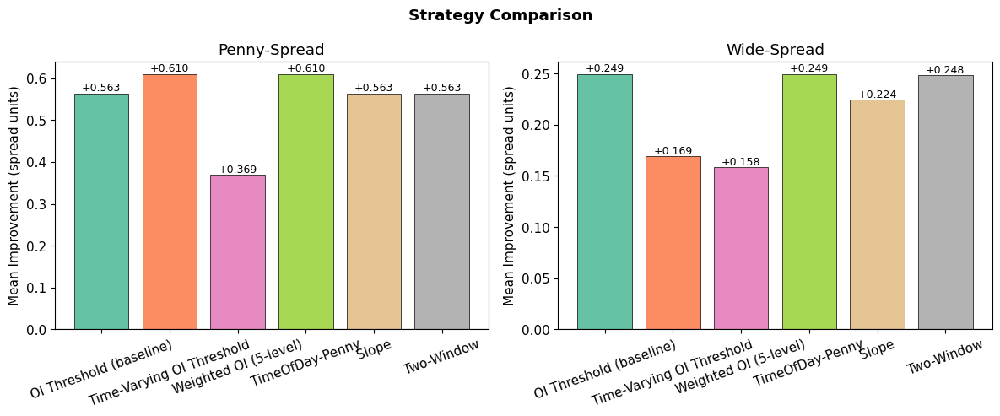

# Optimal Execution Strategy

Beat TWAP by timing execution within each minute using order-book signals.

## How It Works

Each minute, we need to execute one share. Instead of executing at a random time (TWAP), we scan tick-by-tick and execute when two conditions are met:

1. **Signal strength** exceeds a threshold (e.g., order-book imbalance is high enough)
2. **Spread** is tight enough

If neither fires by the last tick, we execute there as a fallback.

Parameters are fit separately for **penny-spread** stocks (INTC, MSFT) and **wide-spread** stocks (AMZN, GOOG). The algorithm auto-detects which type it's dealing with from the first minute of data.

## Final Comparison



Held-out test performance comparison from `base_strategy_walkthrough.ipynb`(5-11-2026-11:45am).

## Project Structure

```
├── README.md                         <- Project overview and usage
├── base_strategy_walkthrough.ipynb   <- Main walkthrough notebook for the full pipeline
├── two_window_experiment.ipynb       <- Extra notebook for the two-window strategy
├── utils/
│   ├── __init__.py                   <- Package marker
│   ├── config.py                     <- All experiment settings in one place
│   ├── preprocessing.py              <- Load CSVs, detect archetype, compute TWAP
│   ├── signals.py                    <- Signal functions (OI, weighted OI, etc.)
│   ├── strategy.py                   <- Strategy classes, fitting logic, run_experiment()
│   └── evaluation.py                 <- Backtest, print_results(), compare_strategies()
├── data/                             <- LOB data CSVs (not committed)
├── requirements.txt                  <- Python dependencies
└── Project Plan 2026.pdf             <- Project planning document
```

## Quick Start

Open `base_strategy_walkthrough.ipynb` and run all cells. It will:
1. Load data and detect stock archetypes
2. Show signal analysis plots
3. Fit parameters via grid search
4. Backtest on held-out data and print results

## Adding a New Strategy

Subclass `BaseStrategy`, implement two methods, and run:

```python
from utils.strategy import BaseStrategy, run_experiment
from utils.config import DEFAULT_CONFIG
import numpy as np

class MyStrategy(BaseStrategy):
    name = 'My Strategy'

    def decide(self, signal, spread, side):
        """Return tick index to execute at, or None for last-tick fallback.

        Args:
            signal: 1D array, higher = stronger buy pressure (auto-flipped for sells)
            spread: 1D array, spread at each tick
            side: 'buy' or 'sell'
        """
        for i in range(len(signal)):
            if signal[i] > self.params['my_threshold'] and spread[i] < self.params['max_spread']:
                return i
        return None

    @classmethod
    def param_grid(cls, archetype):
        """Define the grid search space. Returns {param_name: array_of_values}."""
        return {
            'my_threshold': np.linspace(0.5, 0.95, 20),
            'max_spread': np.linspace(0.01, 0.10, 10),
        }

results = run_experiment(MyStrategy, DEFAULT_CONFIG)
```

Grid search tries every combination, smooths the surface, and picks the best parameters automatically.

## Adding a New Signal

Add a function to `utils/signals.py` and register it:

```python
def my_signal(grp):
    """Must return a 1D array in [0, 1]. Higher = stronger buy pressure."""
    bid_total = grp['BidSize_1'].values + grp['BidSize_2'].values
    ask_total = grp['AskSize_1'].values + grp['AskSize_2'].values
    return bid_total / (bid_total + ask_total)

SIGNAL_REGISTRY['my_signal'] = my_signal
```

Then use it with any strategy:

```python
results = run_experiment(OIThresholdStrategy, DEFAULT_CONFIG, signal_fn='my_signal')
```

## Comparing Strategies

```python
from utils.evaluation import compare_strategies

compare_strategies([
    ('Baseline OI', oi_results),
    ('My Strategy', my_results),
    ('Teammate Strategy', their_results),
])
```

Prints a side-by-side table (mean improvement, std, win rate) and a bar chart.

## Changing Experiment Settings

Edit `utils/config.py` or override in your notebook:

```python
from utils.config import DEFAULT_CONFIG

config = DEFAULT_CONFIG.copy()
config['train_frac'] = 0.8          # 80/20 split instead of 70/30
config['stocks'] = ['INTC', 'MSFT'] # only penny stocks
```

## Key Concepts

- **TWAP benchmark**: For buys, TWAP = mean(ask price) over the minute. For sells, TWAP = mean(bid price). This is a fair comparison since both the strategy and TWAP pay the spread.
- **Archetype detection**: Stocks with median spread <= $0.02 in the first minute are classified as penny-spread. Different parameter sets are fit for each type.
- **Grid search + smoothing**: Every parameter combination is scored on training data. A 3x3 moving average smooths the surface before picking the best point, avoiding overfitting to noisy peaks.
- **Improvement units**: Results are reported in both dollars and "spread units" (improvement / median spread) so penny and wide stocks are comparable.

## Requirements

```
numpy
pandas
scipy
matplotlib
jupyter
```
