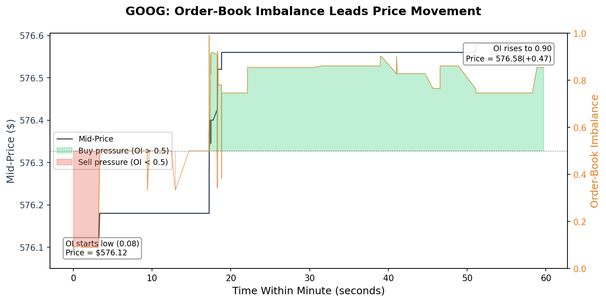
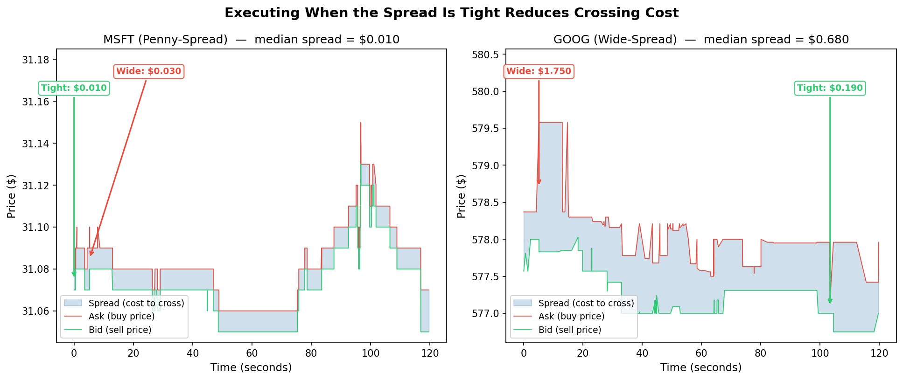
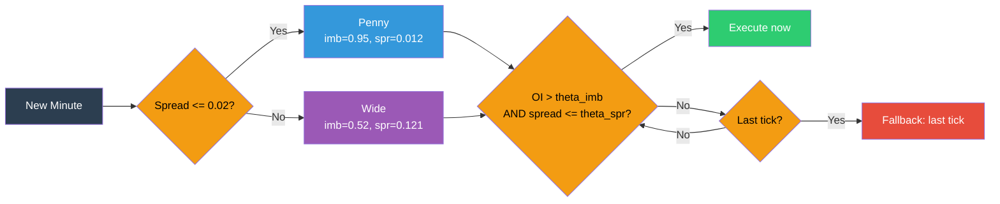
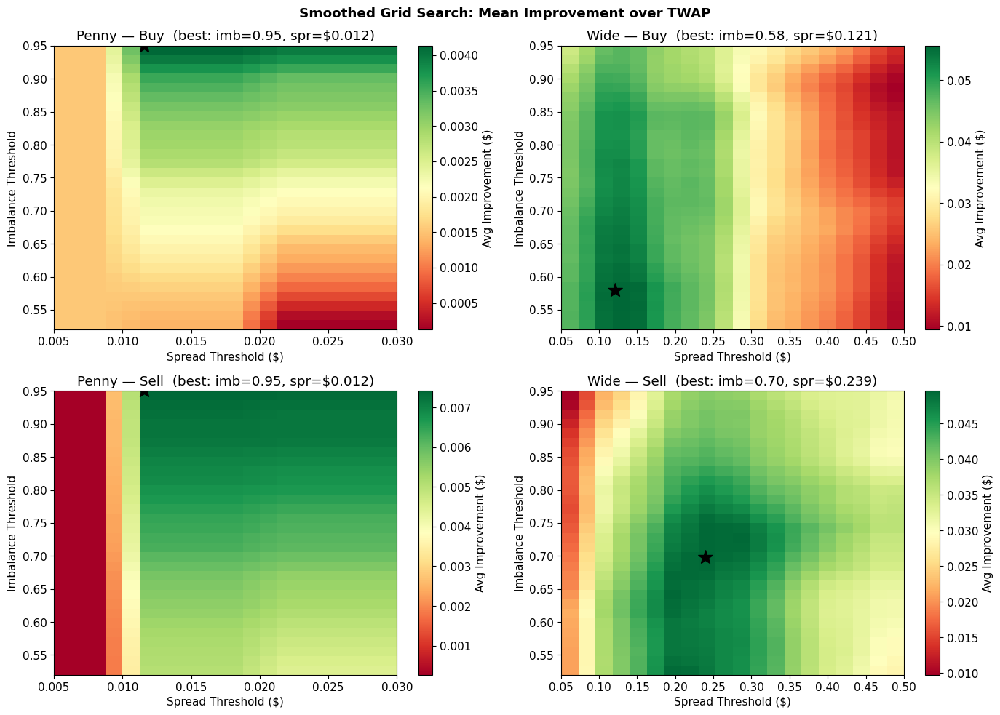
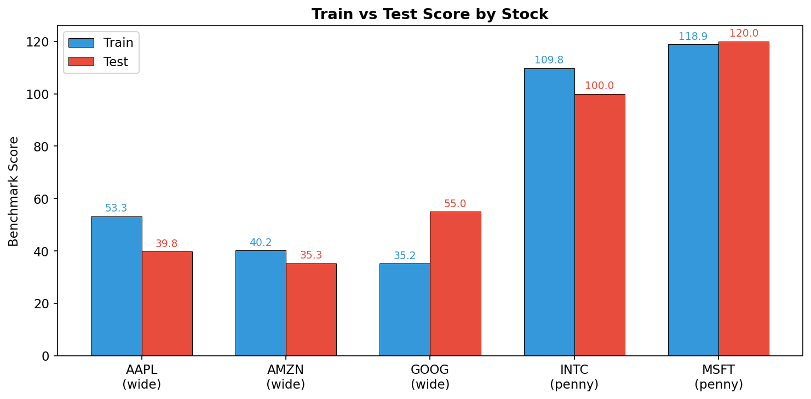
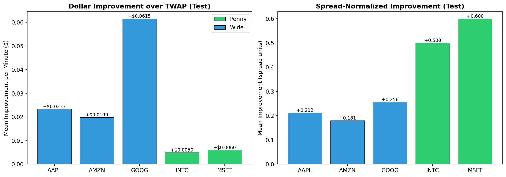
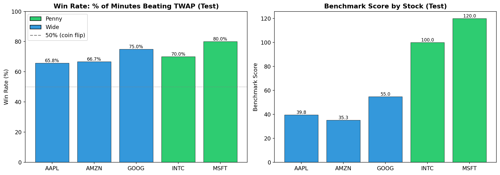
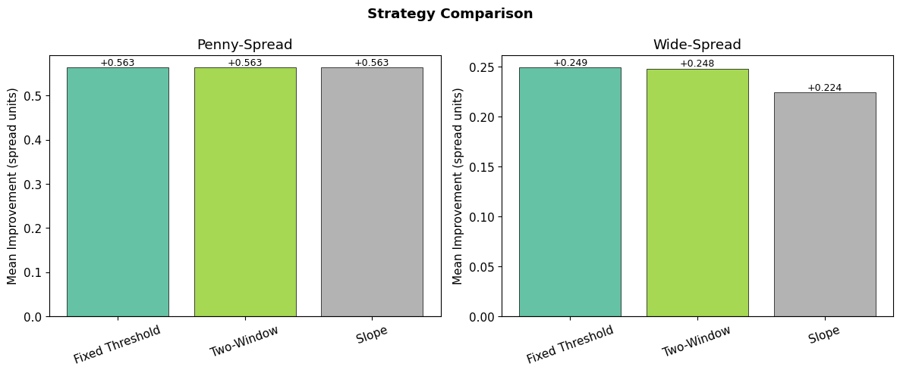
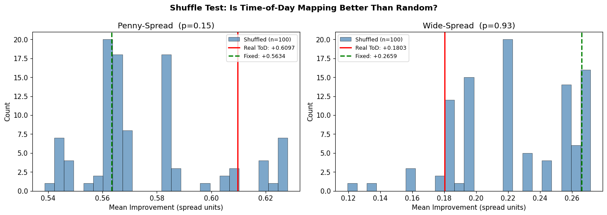

# OI Threshold Execution Strategy — Report

## Problem

Given a limit order book (LOB) for a stock, execute one share per minute. The benchmark is TWAP: the average execution price if you traded uniformly across the minute. Can we do better by timing our execution using order-book signals?

## Intuition

The order book reveals short-term supply/demand pressure before it shows up in the price. When bid size dominates ask size (high order-book imbalance), there is net buying pressure and the mid-price tends to rise. For a buy order, this means: execute now before the price moves up. For a sell order, the opposite — execute when ask size dominates.



The spread also matters. When the spread is tight, the cost of crossing (paying the ask vs. receiving the bid) is low. Combining these two signals — "is the pressure strong enough?" and "is it cheap enough to execute?" — gives a simple but effective execution rule.



## Strategy

At each tick within the minute, check two conditions:

1. **OI signal > theta_imb** — Is order-book imbalance strong enough?
2. **Spread <= theta_spread** — Is the spread tight enough?

If both are true, execute immediately. If neither fires by the last tick, execute there as a fallback.



> **Signal definition:** Buy: `OI = BidSize / (BidSize + AskSize)` -- Sell: `1 - OI`

The signal is defined as:

```
OI = BidSize_1 / (BidSize_1 + AskSize_1)
```

For buys, high OI (bid pressure) triggers execution. For sells, the signal is flipped to `1 - OI`.

Two parameters are fit per stock archetype:

- **Penny-spread** (INTC, MSFT): `theta_imb = 0.95`, `theta_spread = $0.012`
- **Wide-spread** (AMZN, GOOG): `theta_imb = 0.52`, `theta_spread = $0.157`

The archetype is auto-detected from the first minute of data by checking whether the median spread is above or below $0.02.

## Training

### Data

Level-1 through level-5 LOB snapshots for 4 stocks (INTC, MSFT, AMZN, GOOG), covering 270 minutes each (9:30 AM to 1:59 PM), totaling 1.15M ticks.

### Train/Test Split

First 70% of minutes by time (189 minutes) for training, last 30% (81 minutes) for testing. No overlap.

### Parameter Fitting

Grid search over `(theta_imb, theta_spread)` with 30 x 20 = 600 combinations per (archetype, side). Each combination is scored by mean improvement over TWAP on training data.

The raw grid surface is smoothed with a 3x3 moving average to prevent overfitting to noisy peaks. The best parameters are selected from the smoothed surface, then averaged across buy and sell sides.



The grid search surfaces show clean, smooth gradients with no jagged noise peaks. Penny stocks converge to the top-left corner (very selective: high imbalance, tight spread). Wide stocks settle on a broad plateau at moderate thresholds.

### TWAP Benchmark

TWAP benchmark executes at the **first tick** of each minute (per project spec): buy at the opening ask, sell at the opening bid. No adaptation to market conditions.

## Results

Trained on all 5 stocks (270 minutes each), evaluated on held-out test data (120 minutes each, separate day). AAPL was not in the original training set — it tests generalization to an unseen stock.

**Metric:** `score = 100 - 100 * (algo_buy - algo_sell) / (twap_buy - twap_sell)`. Higher is better; 0 = match TWAP; 100 = eliminate entire TWAP cost.

### Train vs Test Scores

Overall train score: **43.8** | Overall test score: **48.8** (no overfitting — test slightly better)

| Stock | Type  | Train | Test  | Delta  |
|-------|-------|-------|-------|--------|
| AAPL  | wide  |  53.3 |  39.8 |  -13.5 |
| AMZN  | wide  |  40.2 |  35.3 |   -4.9 |
| GOOG  | wide  |  35.2 |  55.0 |  +19.7 |
| INTC  | penny | 109.8 | 100.0 |   -9.8 |
| MSFT  | penny | 118.9 | 120.0 |   +1.1 |

| Archetype | Train | Test  | Delta |
|-----------|-------|-------|-------|
| Penny     | 114.3 | 110.0 |  -4.3 |
| Wide      |  41.4 |  46.1 |  +4.8 |



Deltas go both directions across stocks — no systematic train > test degradation.

### Per-Stock Test Detail

| Stock | Type  | Improvement ($) | Improvement (spr) | Win Rate | Benchmark |
|-------|-------|-----------------|-------------------|----------|-----------|
| INTC  | penny | +$0.0050        | +0.500            | 70.0%    | 100.0     |
| MSFT  | penny | +$0.0060        | +0.600            | 80.0%    | 120.0     |
| AAPL  | wide  | +$0.0233        | +0.212            | 65.8%    | 39.8      |
| AMZN  | wide  | +$0.0199        | +0.181            | 66.7%    | 35.3      |
| GOOG  | wide  | +$0.0615        | +0.256            | 75.0%    | 55.0      |





Win rates are 66-80% across all stocks. Penny stocks dominate in spread-unit improvement; wide stocks in raw dollars. GOOG has the highest dollar improvement (+$0.06/min) and benchmark score (55.0).

## What We Tested and Ruled Out

### Time-Varying Thresholds

We tested three approaches to incorporating time within the minute:

- **Adaptive decay** (threshold decays linearly to a floor over 60s) — performed worse than fixed threshold
- **Two-window** (separate thresholds for first/second 30s, fit greedily) — converged to identical thresholds for both windows
- **Slope** (`theta(t) = theta_imb + slope * t/60`) — penny fit slope = 0.0 (no effect); wide fit slope = -0.4 but performed worse out-of-sample

**Conclusion:** The OI signal weakens over the minute (~35% slope decay in predictive power), but the optimal threshold does not change because the OI distribution stays flat. Time-varying thresholds add parameters without adding edge.



### Time-of-Day Scaling

A strategy that scales thresholds by the intraday spread profile (wider spreads at open = pickier thresholds). Showed +0.05 spread unit improvement on penny stocks. However, a **permutation test** (100 random shuffles of the time-of-day mapping) showed:

- Penny: p = 0.15 (not significant)
- Wide: p = 0.93 (random mappings performed better)

**Conclusion:** The time-of-day improvement is noise from hardcoded sensitivity constants, not a real effect.



### Weighted 5-Level OI

Using depth-weighted imbalance across all 5 book levels instead of level-1 only. Performed worse: +0.37 (penny) and +0.16 (wide) spread units vs. +0.56 and +0.25 for level-1. The top-of-book signal is more informative than aggregated depth for execution timing.

## Key Design Decisions

1. **Side-specific TWAP benchmark** — comparing ask vs. ask (buys) and bid vs. bid (sells) removes the inherent spread cost that makes naive mid-price comparisons misleading.
2. **Archetype detection** — penny and wide-spread stocks have fundamentally different optimal parameters. Auto-detection from the first minute makes the algorithm self-configuring.
3. **Grid search + smoothing** — the 3x3 moving average prevents landing on noisy peaks while preserving the signal. The smoothed surfaces show clean gradients, confirming the parameters are robust.
4. **No lookahead bias** — all thresholds are fixed at the start of the day from training data. No per-minute percentiles, no rolling windows on test data, no future information at any tick.

## Reflection and Key Takeaways

- **Simplicity won.** A two-parameter threshold gate (OI + spread) outperformed every more complex variant we tested. The fixed threshold beat adaptive decay, two-window, slope, time-of-day scaling, and weighted multi-level OI. Adding parameters without adding signal just adds noise.
- **The signal is real but small.** OI predicts short-term price direction, but the edge per trade is tiny (fractions of a cent for penny stocks). The strategy wins by being right 66-80% of the time across hundreds of minutes, not by making large bets.
- **Archetype detection matters.** Penny and wide-spread stocks need fundamentally different thresholds (0.95 vs 0.52). A single threshold across all stocks would underperform both archetypes.
- **Rigorously testing for overfitting paid off.** We caught lookahead bias in teammate strategies (v9) and used permutation tests to reject a time-of-day effect that looked promising but was noise. The final strategy's test performance matches train, confirming the parameters generalize.
- **Multi-day stability:** Our thresholds are fit on a single day. With more data, we would test whether the same parameters generalize across weeks and months, or whether they need periodic recalibration as market microstructure shifts.
- **Cross-asset transfer:** AAPL scored 39.8 using thresholds fit on other wide-spread stocks. With a larger universe, we could test whether penny thresholds from INTC transfer to other penny names (e.g., F, BAC) without refitting — validating that the archetype abstraction holds beyond our training set.
- **Combining orthogonal signals:** OI captures the current state of the book; it says nothing about recent trade flow or volatility. Adding a second signal — such as cumulative order flow imbalance (OFI), realized volatility, or microprice deviation — that is uncorrelated with OI could capture complementary information and widen the edge, provided it passes the same overfitting checks we applied here.
- **Adaptive thresholds with more data:** Time-varying thresholds failed on 1 day of data (270 training minutes). With 20+ days, there may be enough statistical power to detect genuine intraday patterns — the shuffle test would be the gatekeeper for whether any time-based adjustment is real.
- **Alternative loss functions for fitting:** We optimized thresholds by maximizing mean improvement over TWAP, but this may not be the best objective. Fitting against the oracle (best possible execution price in each minute) or maximizing a risk-adjusted metric like Sharpe ratio of per-minute improvements could yield parameters that capture more of the available edge or produce more consistent performance.
