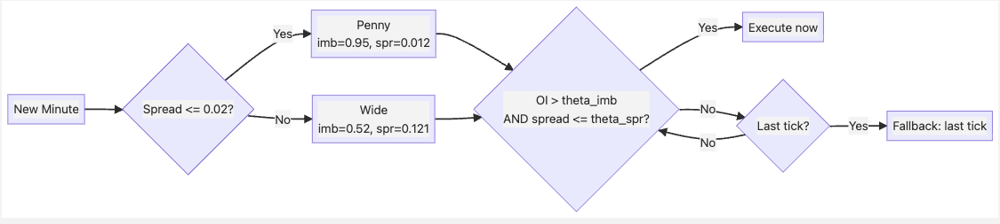

# Optimal Execution with Order-Book Signals

**Beating TWAP using order-book imbalance and spread thresholds**

---

## The Problem: Beat TWAP

- Execute **one share per minute** for each stock
- Benchmark: **TWAP** (execute at first tick of each minute)
- Goal: time execution to get a **better price** than naive first-tick execution
- Metric: `score = 100 - 100 * (algo_cost / twap_cost)`

---

## Intuition: OI Predicts Price Direction

High bid-side imbalance signals upward price pressure — buy before it rises.

---

## Intuition: Cheaper to Cross a Tight Spread

Executing when the spread is narrow reduces the cost of crossing the book.

---

## Strategy: OI + Spread Threshold Gate

At each tick, check two conditions:

| | Condition | Penny | Wide |
|---|---|---|---|
| **Signal** | `OI > theta_imb` | 0.95 | 0.52 |
| **Cost** | `spread <= theta_spread` | $0.012 | $0.121 |

- **Both true** — execute immediately
- **Neither fires by last tick** — fallback execution

> `OI = BidSize / (BidSize + AskSize)` — flipped for sells

---

## Execution Decision Tree

---

## Archetype Detection: Penny vs Wide

Auto-detected from the **first minute** of data:

| | Penny | Wide |
|---|---|---|
| **Stocks** | INTC, MSFT | AAPL, AMZN, GOOG |
| **Median spread** | $0.01 | $0.11 - $0.30 |
| **theta_imb** | 0.95 (very selective) | 0.52 (moderate) |
| **theta_spread** | $0.012 | $0.121 |

Cutoff: median spread <= $0.02

---

## Parameter Fitting: Grid Search + Smoothing

- 600 combinations per (archetype, side)
- 3x3 moving average smooths noisy peaks
- Best params selected from smoothed surface

---

## What We Tried and Ruled Out

Three time-varying threshold approaches — **none beat fixed:**

- **Slope decay** — penny: slope = 0.0; wide: hurt performance
- **Two-window** — converged to identical thresholds both halves
- **Adaptive decay** — worse than fixed across the board

---

## Shuffle Test: Rejecting Time-of-Day Scaling

Permuted the time-of-day mapping 100 times. Real result is **not significant.**

- Penny: p = 0.15 — 15% of random shuffles beat real
- Wide: p = 0.93 — random mappings performed *better*

---

## Final Results: Train vs Test

Overall train: **43.8** | Overall test: **48.8** — no overfitting

---

## Per-Stock Performance

| Stock | Type | Improvement ($) | Improvement (spr) | Win Rate | Score |
|-------|------|-----------------|-------------------|----------|-------|
| INTC | penny | +$0.005 | +0.50 | 70% | 100.0 |
| MSFT | penny | +$0.006 | +0.60 | 80% | 120.0 |
| AAPL | wide | +$0.023 | +0.21 | 66% | 39.8 |
| AMZN | wide | +$0.020 | +0.18 | 67% | 35.3 |
| GOOG | wide | +$0.062 | +0.26 | 75% | 55.0 |

---

## No Overfitting: Train-Test Deltas

| Stock | Train | Test | Delta |
|-------|-------|------|-------|
| AAPL | 53.3 | 39.8 | -13.5 |
| AMZN | 40.2 | 35.3 | -4.9 |
| GOOG | 35.2 | 55.0 | **+19.7** |
| INTC | 109.8 | 100.0 | -9.8 |
| MSFT | 118.9 | 120.0 | +1.1 |

- Deltas go **both directions** — no systematic degradation
- AAPL (unseen stock) still scores 39.8
- Permutation test rejected spurious improvements

---

## Reflection and Key Takeaways

- **Simplicity won** — 2-parameter gate beat every complex variant
- **Signal is real but small** — wins by being right 66-80% of the time
- **Archetype detection matters** — penny vs wide need different thresholds
- **Rigorous overfitting checks** — caught lookahead bias in teammate code, rejected noise with shuffle tests
- **Future work** — multi-day stability, cross-asset transfer, combining OI with orthogonal signals
